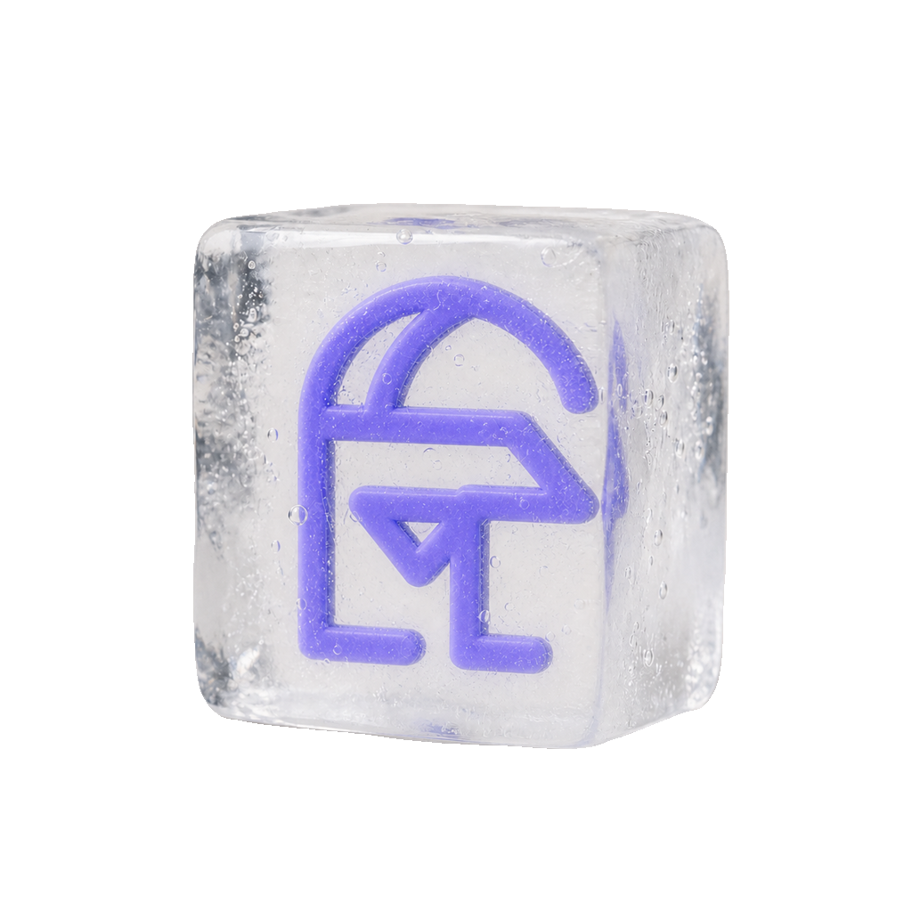

  

<h1 align="center">Pallas</h1>

Pallas 是 Aegis 面向用户的认证界面。登录、OAuth 授权同意、回调、错误提示、个人资料和账户安全设置，都由它承接。它不碰认证逻辑本身——那些都在 Aegis 后端——Pallas 只负责把这些流程做成一个像样的前端。

Pallas is the human-facing authentication UI for Aegis: login, OAuth consent, callbacks, error presentation, profile, and account security. The auth logic lives in Aegis; Pallas turns those flows into the actual interface.