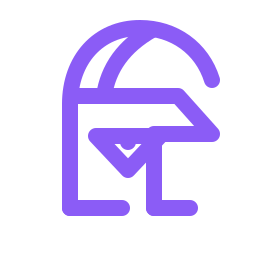

<p align="center">
  
</p>

<h1 align="center">Pallas</h1>

<p align="center">
  <strong>The human-facing authentication experience for Aegis.</strong><br />
  面向用户的 Aegis 认证与账户安全界面。
</p>

## Overview / 项目简介

Pallas provides login, OAuth consent, callback handling, error presentation, profile, privacy, terms, and account-security experiences backed by Aegis.

Pallas 是 Aegis 的认证前端，负责登录、OAuth 授权同意、回调处理、错误展示、个人资料和账户安全体验。

## Capabilities

- Multiple identity providers, Passkeys, MFA, and challenge flows
- OAuth consent and redirect handling
- Profile and security settings
- Responsive failure, expiration, and repeat-submission states

## Technology

React 19, TypeScript, Vite 7, React Router 7, Sass, Ant Design, and `@heliannuuthus/ui`.

## Development

```bash
pnpm install
pnpm dev
pnpm type-check
pnpm lint
pnpm build
pnpm format:check
```

Copy `.env.example` to `.env` before local development. API access stays in `src/services`; authentication flow state remains inside Pallas.
